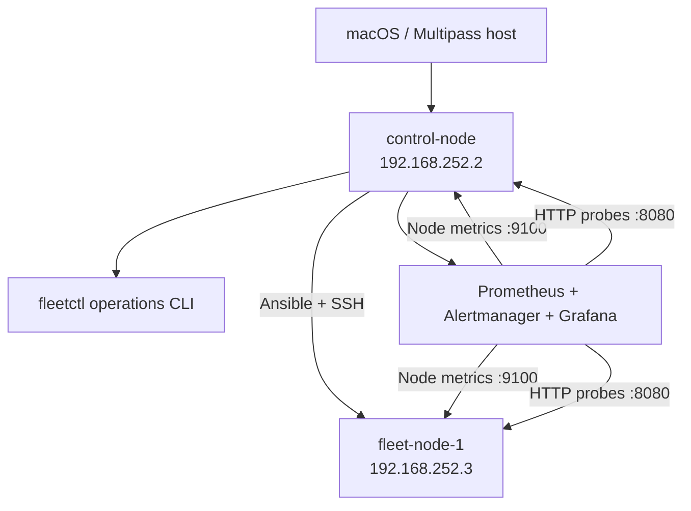

# Linux Systems & Reliability Lab

A two-node Linux operations lab for provisioning, monitoring, diagnosing, and
recovering services across a small server fleet.

The project models the operational workflow used by fleet reliability teams:

```text
provision -> validate -> monitor -> detect -> diagnose -> remediate -> verify
```

## Architecture



Each node runs:

- a hardened systemd-managed web service;
- an internal systemd health-check timer;
- Prometheus Node Exporter;
- a dedicated unprivileged service account.

The control node additionally runs:

- Ansible for idempotent fleet provisioning;
- `fleetctl` for health checks, diagnostics, and remediation;
- Prometheus, Blackbox Exporter, Alertmanager, and Grafana.

## Reliability Features

- systemd startup and automatic process recovery;
- dedicated service identity and filesystem permissions;
- systemd hardening with `NoNewPrivileges`, `ProtectSystem`, and `ProtectHome`;
- idempotent multi-node Ansible provisioning;
- concurrent external HTTP and metrics checks;
- node, CPU, memory, disk, and workload alerts;
- provisioned Grafana dashboard and Prometheus datasource;
- remote evidence collection before remediation;
- explicit confirmation for service-changing fleet operations;
- runbooks and evidence-based postmortems;
- automated configuration validation in CI.

## Repository Layout

```text
ansible/                 Fleet inventory and provisioning playbook
config/                  fleetctl node inventory
docs/postmortems/        Completed incident reviews
docs/runbooks/           Detection, diagnosis, and recovery procedures
monitoring/              Prometheus, Alertmanager, Blackbox, and Grafana config
scripts/fleetctl.py      Fleet operations CLI
scripts/provision-fleet.sh
scripts/install-monitoring.sh
scripts/verify-lab.sh
systemd/                 Web service and health-check units
```

## Lab Requirements

- macOS with Multipass;
- approximately 5 GB of available RAM for both VMs;
- Ubuntu 26.04 LTS ARM64 or AMD64;
- network access for Ubuntu packages and container images.

The checked-in inventory uses the following lab addresses:

| Node | Address | CPU | Memory | Disk |
| --- | --- | ---: | ---: | ---: |
| `control-node` (`reliability-lab`) | `192.168.252.2` | 2 | 4 GB | 30 GB |
| `fleet-node-1` | `192.168.252.3` | 1 | 1 GB | 8 GB |

Update `ansible/inventory.ini`, `config/fleet.json`, and
`monitoring/prometheus/prometheus.yml` if Multipass assigns different addresses.

## Provisioning

The control node requires Ansible and a dedicated SSH key that can access the
worker. The private key must remain outside Git at:

```text
/home/ubuntu/.ssh/fleet_lab_ed25519
```

From the repository on the control node, validate connectivity:

```bash
ansible -i ansible/inventory.ini fleet -m ping
```

Provision or update all nodes:

```bash
./scripts/provision-fleet.sh
```

A successful repeated run should report `changed=0`, demonstrating
idempotency.

## Fleet Operations

List nodes:

```bash
./scripts/fleetctl.py inventory
```

Check web and metrics health concurrently:

```bash
./scripts/fleetctl.py health
```

Collect diagnostic evidence:

```bash
./scripts/fleetctl.py diagnose fleet-node-1
```

Perform a confirmed service operation:

```bash
./scripts/fleetctl.py restart fleet-node-1 --yes
```

## Monitoring

Install and start the monitoring stack on the control node:

```bash
sudo ./scripts/install-monitoring.sh
```

The installer generates a local Grafana password in `monitoring/.env` with
mode `0600`. The file is ignored by Git.

Services are exposed on the control-node address:

| Component | Port |
| --- | ---: |
| Grafana | `3000` |
| Prometheus | `9090` |
| Alertmanager | `9093` |
| Blackbox Exporter | `9115` |

The provisioned Grafana dashboard is named **Linux Fleet Overview**.

## Verification

Run the complete operational verification:

```bash
./scripts/verify-lab.sh
```

The script verifies:

- both web services;
- both Node Exporter endpoints;
- all monitoring readiness endpoints;
- expected Prometheus target totals;
- absence of active Prometheus alerts.

## Failure Exercise

Stop only the worker workload:

```bash
./scripts/fleetctl.py stop fleet-node-1 --yes
```

Expected behavior:

- worker web health becomes `DOWN`;
- worker metrics remain `UP`;
- `FleetWebServiceDown` transitions from `pending` to `firing`;
- the control-node workload remains healthy.

Recover the worker:

```bash
./scripts/fleetctl.py start fleet-node-1 --yes
./scripts/verify-lab.sh
```

See the [fleet service-down runbook](docs/runbooks/fleet-web-service-down.md)
and the [completed outage postmortem](docs/postmortems/2026-09-01-fleet-node-1-service-outage.md).

## Current Scope

This lab intentionally focuses on node operations and reliability workflows.
It does not emulate physical GPU hardware, BMC/IPMI access, InfiniBand, or a
production Kubernetes cluster. Those are planned as separate extension labs.
